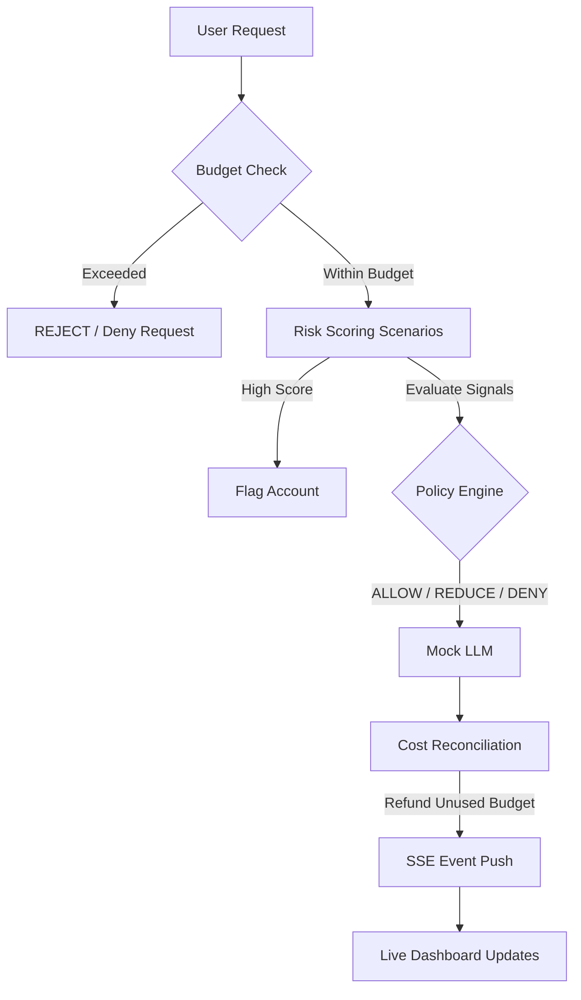

# CostShield

### AI Cost Security & Token Burn Defense

CostShield protects AI applications from abusive or excessively expensive LLM usage and helps prevent token-burn attacks from turning into uncontrolled costs. By introducing a real-time defense pipeline that combines budget caps, risk scoring, and dynamic output reduction, CostShield intercepts requests before execution to protect resources.

---

## 1. The Problem

LLM API calls cost money. Attackers exploit this financial surface using **Token-Burn attacks** intended to drain credit limits and overwhelm systems. Attack vectors include:
* **Output Maximization**: Requesting long or recursive text outputs.
* **Context Stuffing**: Injecting massive payloads into inputs to inflate token charges.
* **Request Bursts**: Running concurrent requests to bypass traditional limits.

Standard rate limiting checks only the request count, ignoring actual input/output token usage, behavior history, and cost velocity. CostShield focuses on:
```
Usage + Cost + Behavior
```

---

## 2. The Solution

CostShield acts as an inline defensive gateway between users and LLMs. The pipeline evaluates the threat profile of every request before forwarding it to the model.



---

## 3. Defense System

CostShield uses deterministic signals to evaluate threat profiles and generate a risk score from `0` to `10`.

### Scoring Signals
* **Token Volume**: Evaluating raw count metrics.
* **Verbosity Request**: Checking for recursive patterns or length-maximizing instructions.
* **Request Bursts**: Identifying concurrent bursts per user.
* **Cost Velocity**: Monitoring rolling expenditure per minute.
* **Repeated Prompts**: Detecting repetitive input signatures.

### Graduated Policies

| Risk Score | Policy Action | Action Effect |
| :---: | :---: | :--- |
| **0 – 4** | `ALLOW` | Passes request to the model with standard budget restrictions. |
| **5 – 6** | `REDUCE_50` | Automatically scales down max output tokens by 50% to restrict expenditure. |
| **7** | `REDUCE_TO_MIN` | Scales output down to a strict minimum cap (e.g. 5 tokens). |
| **8 – 9** | `SOFT_DENY` | Rejects prompt temporarily. User is asked to wait. |
| **10** | `HARD_DENY` | Completely blocks request and flags the account, blocking future requests. |

---

## 4. Key Features

* **Redis-Backed Budget Enforcement**: Real-time tracking and reservation of daily user budgets.
* **Graduated Policy Engine**: Soft mitigations (token cap reduction) instead of binary blocking.
* **Cost Reconciliation**: Calculates actual tokens generated and refunds unused reserved balances.
* **Protected vs Unprotected Comparison**: Chat interface evaluating the Protected tier against an Unprotected baseline.
* **SSE Live Stream**: Server-Sent Events push request logs to the dashboard in real-time.
* **Telemetry Isolation**: Filters comparison traffic so dashboard metrics reflect only Protected production figures.
* **Attack Simulators**: Embedded simulation options to trigger attacks and evaluate defense behaviors live.

---

## 5. Attack Simulators

* **Naive Output Maximizer**: Floods requests asking for recursive, long summaries to run up generation costs.
* **Context Stuffer**: Submits long prompts to inflate input token counts.
* **Sybil Burst**: Spawns multiple concurrent user requests to bypass hourly rate limits.

---

## 6. Live Dashboard Views

* **Prevented Spend**: Reconciles saved costs by comparing Protected vs Unprotected responses.
* **Total Spend**: Live tally of protected API expenditures.
* **Mitigation Rate**: Percentage savings achieved by CostShield policies.
* **Blocked Threats**: Count of requests blocked by policies.
* **CostShield Impact**: Compares Protected vs Unprotected request costs over a rolling window.
* **Spend Velocity**: Tracks roll-ups against critical cost thresholds.
* **Heatmap & Gauges**: Monitors traffic per user and highlights budget caps.
* **Live Defense Feed**: Logs score, action, and token metrics.

---

## 7. Tech Stack

* **Language**: Python
* **Web Framework**: FastAPI
* **Caching & Broker**: Redis
* **Database Logs**: SQLite
* **Frontend**: HTML5, CSS3, JavaScript
* **Telemetry Visuals**: Chart.js
* **SSE Client**: EventSource API

---

## 8. Demo Flow

1. **Enter Prompt**: Input a prompt in the chat console.
2. **Compare Tiers**: Click **Compare Unprotected** to view Protected (Emerald) vs Unprotected (Rose) side-by-side.
3. **Trigger Attacks**: Go to the Dashboard and select **Naive Output Maximizer**, **Context Stuffer**, or **Sybil Burst**.
4. **Observe Defenses**: Observe the chatbot status badges and action stream logs transition to `REDUCE` or `BLOCKED`.
5. **View Reconciliations**: Refresh the charts to see the cost difference on the **CostShield Impact** graph.

---

## Team

**Dia Arora**  
**Aayush Bhandhari**
